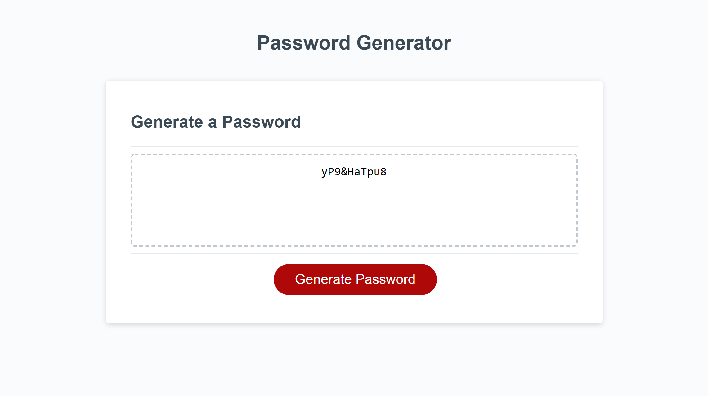

# 03-Week-HW-mmonyok

## Description
- The purpose of this project is to build a system to randomly generate passwords based on selected criteria by the user once the user clicks on the generate password button and selects their password criteria.
- This project solidified a lot of the JavaScript concepts I've learned in class this week and the previous week. I utilized DOM query selectors, even listeners, function, array, etc. It taught me to really think about the processes needed in order to complete a specific task. 

## Screenshot

## Deployed Site
[Link to live site.](https://mmonyok.github.io/03-Week-HW-mmonyok/)
